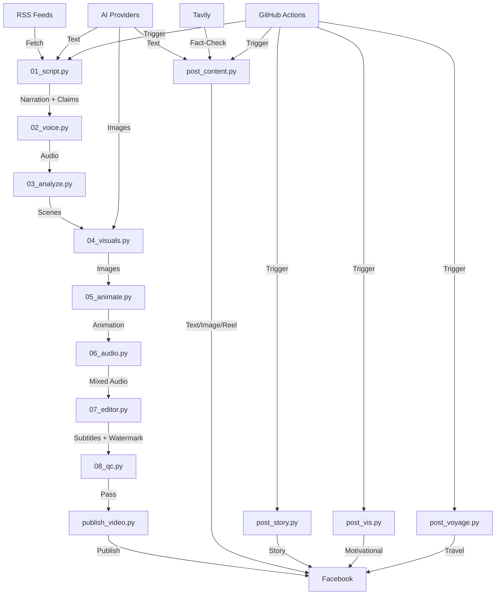

# Nyavodroid — OnC

> **Automated Social Media Content Generation & Publishing System**
> *Powered by AI, Driven by Reliability*

[](https://www.python.org/downloads/)
[](https://github.com/nyavorakotomavo/OnC/blob/main/LICENSE)
[](https://github.com/features/actions)
[](https://github.com/psf/black)

---

## 📌 About OnC

**OnC** (One Click Content) is a **fully automated social media publishing system** designed to generate and publish high-quality content across multiple brands and platforms. Built by [Nyavo Rakotomavo](https://github.com/nyavorakotomavo), OnC leverages **AI providers**, **RSS feeds**, and **GitHub Actions** to deliver **reliable, fact-checked, and engaging content** 24/7.

### 🎯 **Core Mission**
- **Automate** the entire content creation pipeline — from research to publishing.
- **Ensure reliability** with multi-source fact-checking and provider fallbacks.
- **Support multiple brands** (Nyavo, VIS, VoyageMadagascar) with distinct editorial voices.
- **Deliver premium quality** with professional styling, typography, and design.

---

## ✨ Features

### 📰 **Content Generation**
| Feature | Description | Brands |
|---------|-------------|--------|
| **Multi-Format Posts** | Text-only, image+text, reels | Nyavo, VIS |
| **Facebook Stories** | Short, engaging stories with LLM self fact-check | Nyavo |
| **AI-Generated Videos** | Full video pipeline (script → voice → visuals → publish) | Nyavo |
| **Themed Content** | Predefined topics and styles per brand | All |
| **Fact-Checking** | Tavily + Mistral verification for accuracy | Nyavo |

### 🤖 **AI Provider Cascade**
OnC uses a **priority-based fallback system** to ensure **maximum uptime** and **cost efficiency**:

#### **Text Generation**
```
Mistral → Together → Gemini → Hugging Face
```

#### **Image Generation (Nyavo)**
```
Gemini → Cloudflare → Hugging Face → Together → Fal.ai → Pollinations
```

#### **Image Generation (VIS)**
```
Cloudflare → Pollinations
```

> ⚡ **Note:** A `429` (rate limit) automatically triggers a switch to the next provider.

### 📡 **RSS Feed Integration**
OnC pulls from **trusted sources** to ensure content quality:
- **Tier 1 (Official/Scientific):** Nature, NASA, IEEE Spectrum, ScienceDaily
- **Tier 2 (Tech Media):** BBC Tech, The Verge, Ars Technica, TechCrunch, Le Monde Pixels

### 🎨 **Theming System**
Each brand has a **YAML configuration** defining:
- Color palettes
- Fonts (Inter, Nunito)
- Image styles
- Editorial pillars
- Predefined topics

Example themes:
- [`themes/nyavo.yaml`](themes/nyavo.yaml) — Tech & Science
- [`themes/vis.yaml`](themes/vis.yaml) — Motivational Content
- [`themes/voyage_madagascar.yaml`](themes/voyage_madagascar.yaml) — Travel & Tourism

---

## 🚀 Getting Started

### 📥 **Prerequisites**
- **Python** >= 3.11
- **Git**
- **FFmpeg** (for video processing)
- **ImageMagick** (for image conversion)
- **GitHub Account** (for workflows)

### 🛠️ **Installation**

#### 1. Clone the Repository
```bash
git clone https://github.com/nyavorakotomavo/OnC.git
cd OnC
```

#### 2. Install Dependencies
```bash
pip install -r requirements.txt
```

#### 3. Install System Dependencies (Ubuntu/Debian)
```bash
sudo apt-get update && sudo apt-get install -y ffmpeg fonts-dejavu-core imagemagick
```

#### 4. Download Required Fonts
```bash
python download_fonts.py
```

#### 5. Set Up Environment Variables
Copy the example environment file and configure your API keys:
```bash
cp .env.example .env
# Edit .env with your API keys
```

---

## 🔧 Configuration

### 🗝️ **Environment Variables**

Create a `.env` file in the root directory with the following variables:

#### **Facebook API**
```env
FB_PAGE_ID=your_facebook_page_id
FB_PAGE_ACCESS_TOKEN=your_page_access_token
VIS_FB_PAGE_ID=your_vis_page_id
VIS_FB_PAGE_TOKEN=your_vis_page_token
FACEBOOK_PAGE_ACCESS_TOKEN=your_token
FACEBOOK_PAGE_ID=your_page_id
```

#### **AI Providers**
```env
# Text Generation
GEMINI_API_KEY_CONTENT=your_gemini_key
GEMINI_API_KEY_STORY=your_gemini_story_key
MISTRAL_API_KEY=your_mistral_key
TOGETHER_API_KEY=your_together_key
HF_TOKEN=your_huggingface_token

# Image Generation
CLOUDFLARE_ACCOUNT_ID=your_account_id
CLOUDFLARE_API_TOKEN=your_api_token
CLOUDFLARE_ACCOUNT_ID_2=your_account_id_2
CLOUDFLARE_API_TOKEN_2=your_api_token_2
CLOUDFLARE_ACCOUNT_ID_3=your_account_id_3
CLOUDFLARE_API_TOKEN_3=your_api_token_3
FREEAI_API_KEY=your_freeai_key
FAL_API_KEY=your_fal_key
REPLICATE_API_TOKEN=your_replicate_token

# Search & Verification
TAVILY_API_KEY=your_tavily_key
PEXELS_API_KEY=your_pexels_key
```

#### **Control Variables**
```env
# Brand Selection (nyavo or vis)
BRAND=nyavo

# Strategy Configuration (JSON payload)
STRATEGIE_JSON='{"format": "image_texte", "pilier": "secrets_code"}'

# Force Format (override strategy)
FORCE_FORMAT=texte_seul

# VIS Brand Controls
VIS_FORCE_PILIER=aleatoire
VIS_EXCLUDE=story
VIS_DRY_RUN=0  # Set to 1 to skip actual publishing
```

---

## 🎬 Usage

### 📝 **Manual Publishing**

#### Publish Nyavo Content
```bash
# Default (auto-selects format based on time)
python post_content.py

# Force a specific format
FORCE_FORMAT=image_texte python post_content.py
```

#### Publish VIS Content
```bash
BRAND=vis python post_vis.py
```

#### Publish a Facebook Story
```bash
python post_story.py
```

#### Publish VoyageMadagascar Content
```bash
python post_voyage.py --content-type travel_guide --auto-publish
```

### 🎥 **Video Pipeline**
Run the pipeline step-by-step:
```bash
# Step 1: Generate script from RSS feeds
python video_pipeline/01_script.py

# Step 2: Generate voice (Edge TTS)
python video_pipeline/02_voice.py

# Step 3: Analyze scenes
python video_pipeline/03_analyze.py

# Step 4: Generate visuals (AI + Pexels fallback)
python video_pipeline/04_visuals.py

# Step 5: Animate
python video_pipeline/05_animate.py

# Step 6: Mix audio
python video_pipeline/06_audio.py

# Step 7: Final assembly (subtitles, watermark)
python video_pipeline/07_editor.py

# Step 8: Quality check (blocking)
python video_pipeline/08_qc.py

# Publish to Facebook
python video_pipeline/publish_video.py
```

Or let **GitHub Actions** handle it automatically (see [Workflows](#-github-actions-workflows)).

---

## 🔄 GitHub Actions Workflows

OnC uses **7 automated workflows** to publish content on a schedule:

| Workflow | Trigger | Frequency | Script | Brand |
|----------|---------|-----------|--------|-------|
| [`auto_content.yml`](.github/workflows/auto_content.yml) | Cron + Manual | 3x/day (7:00, 9:30, 17:00 UTC) | `post_content.py` | Nyavo |
| [`auto_story.yml`](.github/workflows/auto_story.yml) | Cron + Manual | 3x/day | `post_story.py` | Nyavo |
| [`auto_video.yml`](.github/workflows/auto_video.yml) | Cron + Manual | 1x/day (17:00 UTC) | `video_pipeline/*` | Nyavo |
| [`vis.yml`](.github/workflows/vis.yml) | Cron + Manual | 4x/day (7:00, 17:00 UTC) | `post_vis.py` | VIS |
| [`vis_stories.yml`](.github/workflows/vis_stories.yml) | Cron | 2x/day (12:00, 21:00 UTC) | `post_vis.py` | VIS |
| [`voyage_madagascar.yml`](.github/workflows/voyage_madagascar.yml) | Cron | 3x/day (4:00, 11:00, 17:00 UTC) | `post_voyage.py` | Voyage |

### 🔧 **Manual Trigger**
To manually trigger a workflow:
1. Go to **Actions** tab in GitHub.
2. Select the workflow (e.g., `Auto-post Nyavodroid - Multi-formats`).
3. Click **Run workflow** -> **Run workflow** (or specify inputs if available).

---

## 🗂️ Project Structure

```
OnC/
├── .github/
│   └── workflows/              # GitHub Actions workflows
│       ├── auto_content.yml
│       ├── auto_story.yml
│       ├── auto_video.yml
│       ├── reception-strategie.yml
│       ├── vis.yml
│       ├── vis_stories.yml
│       └── voyage_madagascar.yml
├── assets/                    # Static assets
│   ├── emojis/                # Custom emojis
│   ├── expressions/           # Facial expressions
│   ├── fonts/                 # Fonts (Inter, Nunito)
│   ├── profile.png           # Nyavo profile picture
│   └── profile_vis.png        # VIS profile picture
├── themes/                   # Brand themes (YAML)
│   ├── eco_madagascar.yaml
│   ├── nyavo.yaml
│   ├── vis.yaml
│   └── voyage_madagascar.yaml
├── video_pipeline/           # Video generation pipeline
│   ├── 01_script.py          # Script generation (RSS -> narration)
│   ├── 02_voice.py           # Voice synthesis (Edge TTS)
│   ├── 03_analyze.py         # Scene analysis
│   ├── 04_visuals.py         # Visual generation (AI + Pexels)
│   ├── 05_animate.py         # Animation
│   ├── 06_audio.py           # Audio mixing
│   ├── 07_editor.py          # Final assembly
│   ├── 08_qc.py              # Quality check
│   ├── publish_video.py      # Facebook publishing
│   ├── config_video.py       # Configuration
│   └── sfx/                  # Sound effects
├── *.py                      # Main scripts
│   ├── charger_strategie.py  # Strategy loader
│   ├── content_config.py     # Theme loader
│   ├── content_config_nyavo.py # Legacy Nyavo config
│   ├── content_config_vis.py  # Legacy VIS config
│   ├── download_emojis.py    # Emoji downloader
│   ├── download_fonts.py     # Font downloader
│   ├── download_sfx.py       # Sound effects downloader
│   ├── fact_checker.py       # Fact-checking (Tavily + Mistral)
│   ├── nyavo_media.py        # AI provider abstraction (42 KB)
│   ├── post_content.py       # Multi-format publishing (Nyavo)
│   ├── post_story.py         # Facebook stories
│   ├── post_vis.py           # VIS brand publishing
│   └── post_voyage.py        # VoyageMadagascar publishing
├── AGENTS.md                 # Agent documentation
├── .env.example              # Environment variables template
├── LICENSE                   # Proprietary License
├── push_onc.sh               # Deployment script
├── published_history.json    # Publishing history (auto-committed)
└── requirements.txt          # Python dependencies
```

---

## 🔍 Architecture Overview



---

## 🤝 Contributing

We welcome contributions! Here's how you can help:

### 🐛 **Reporting Bugs**
1. Check if the issue already exists in [GitHub Issues](https://github.com/nyavorakotomavo/OnC/issues).
2. Open a new issue with:
   - A clear title.
   - Steps to reproduce.
   - Expected vs. actual behavior.
   - Screenshots (if applicable).

### 🛠️ **Submitting Changes**
1. Fork the repository.
2. Create a feature branch (`git checkout -b feature/your-feature`).
3. Commit your changes (`git commit -m 'feat: add your feature'`).
4. Push to the branch (`git push origin feature/your-feature`).
5. Open a **Pull Request** and describe your changes.

### 📜 **Pull Request Guidelines**
- Follow [Conventional Commits](https://www.conventionalcommits.org/) for commit messages.
- Keep PRs small and focused.
- Add tests for new features.
- Update documentation if needed.

---

## 📜 License

**⚠️ PROPRIETARY LICENSE - STRICT RESTRICTIONS APPLY**

This project is **NOT open source**. Usage is **strictly limited to non-commercial, personal purposes only**.

### 🚫 **STRICTLY PROHIBITED:**
- ❌ **NO commercial use** (including monetization, advertising, or any revenue-generating activity)
- ❌ **NO distribution** (selling, sharing, sublicensing, or giving the code to third parties)
- ❌ **NO resale** (of the code, modified versions, or services based on it)
- ❌ **NO SaaS/hosted services** (publicly accessible services using this code)
- ❌ **NO removal of license notices**

### ⚠️ **AI-GENERATED CONTENT DISCLAIMER:**
- The author **is NOT responsible** for any content generated by AI models.
- AI-generated content may contain **errors, inaccuracies, or offensive material**.
- Users are **solely responsible** for verifying accuracy, legality, and appropriateness of AI-generated content.
- AI-generated content **must NOT** be used for critical decisions (medical, legal, financial, safety) without human verification.

### 📄 **Full License Text**
See [LICENSE](LICENSE) for complete legal terms and conditions.

---

## 🙏 Acknowledgments

- **AI Providers**: Mistral, Together, Gemini, Cloudflare, Hugging Face, Fal.ai, Pollinations, Pexels, Tavily
- **Open Source**: Python, Pillow, PyYAML, Edge TTS, FFmpeg, ImageMagick
- **Inspiration**: The need for **reliable, automated, and high-quality** social media content.

---

## 📞 Contact

- **Author**: [Nyavo Rakotomavo](https://github.com/nyavorakotomavo)
- **Email**: nyavosapp@gmail.com
- **GitHub**: [nyavorakotomavo](https://github.com/nyavorakotomavo)
- **Project Link**: [https://github.com/nyavorakotomavo/OnC](https://github.com/nyavorakotomavo/OnC)

---

<p align="center">
  Made with ❤️ by Nyavo Rakotomavo | Powered by AI
</p>
